# CUDA GPT2 Inference

## Introduction

GPT-2 (Generative Pretrained Transformer 2) is a transformer-based language model developed by OpenAI, released in 2019. It is based on transformer which is adopted widely in most of the LLMs nowadays. In this article, we will be focusing on optimizing the runtime for inference stage using a **single A40 Nvidia GPU**.


The image above shows the flow of the inference step:
- `encoder`: Converts the input data into a compact, meaningful representation.
- `layernorm`: Helps stabilize the outputs of the model by keeping the outputs well-scaled.
- `matmul`: Performs matrix multiplication to transform inputs using learned weights, essentially a fully connected layer.
- `attention`: Assigns dynamic weights to different parts of the input, allowing the model to focus on relevant information for better understanding.
- `residual`: Preserves information from previous layers while adding new information from subsequent layers.
- `gelu`: Introduces non-linearity into the model, allowing it to capture more complex patterns and make creative inferences.

## Baseline

We will use Karpathy's [llm.c](https://github.com/karpathy/llm.c) as the baseline of our optimizations. Specifically, `train_gpt2_fp32.cu` is the code that we ran as the baseline. Note that `train_gpt2_fp32.cu` is not the most optimized implementation, however, the reason the we chose this to be the baseline is to employ 32 bit floating precision.


As we can see from the figure above, inference stage spent most of the time in `matmul` followed by `attention`. Hence, optimizing these 2 kernels can affect the overall runtime the most.

## Matmul
 
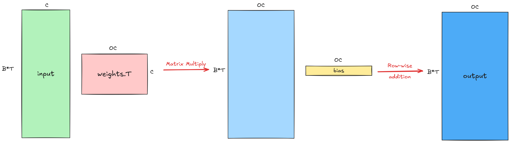

Matmul at its core is matrix multiplication.

### Approach 1: [Tiling](https://github.com/GJ0407790/CUDA-GPT2-Inference/blob/main/kernels/matmul/1_matmul_tiling.cuh)

We first implemented matmul using basic 2D block tiling.

> This [article](https://siboehm.com/articles/22/CUDA-MMM) provides a good step-by-step guide to optimize matrix multiplication.

Using tile width of 16 result in total **8,337.43ms** which is **14.9x** times slower than baseline.

### Approach 2: [cuBLAS](https://github.com/GJ0407790/CUDA-GPT2-Inference/blob/main/kernels/matmul/3_matmul_cublas.cuh)

[cuBLAS](developer.nvidia.com/cublas) is a GPU-accelerated library by NVIDIA for linear operations. cuBLAS uses various functions by [CUTLASS](https://github.com/NVIDIA/cutlass) underneath.

```cuda
cublasOperation_t transa = CUBLAS_OP_T;
cublasOperation_t transb = CUBLAS_OP_N;
float alpha = 1.0f;
float beta = 0.0f;
cublasSgemm_v2(cublas_handle, transa, transb, OC, B*T, C, &alpha, weight, C, inp, C, &beta, out, OC);

if (bias != nullptr) 
{
  add_bias(out, bias, B, T, OC);
}
```
Because the bias is just a vector, we either have to:
  1. Duplicate it into a 2D matrix with the same shape as output and pass in the bias matrix as accumulator.
  2. Use `cublasSgemm_v2` just for the matrix multiplication and launch another kernel to do row-wise addition.

In the end, the second appraoch is more efficient. The total latency (for both matmul and add bias) is **200.24ms** which is **2.8x** faster than the baseline.

### Approach 3: [Tensor Cores](https://github.com/GJ0407790/CUDA-GPT2-Inference/blob/main/kernels/matmul/3_matmul_tensor.cuh)

To understand how cuBLAS achieves such amazing speedup, we decided to dive in the details to see its implementation. 

First, it utilizes tensor core, which is a piece of hardware that specializes in matrix multiplication and provides a huge performance boost compared to the traditional ALU. CUDA provides [warp matrix functions](https://docs.nvidia.com/cuda/cuda-c-programming-guide/) to operate on tensor cores. The code below shows how warp matrix functions were used to compute the matrix multiplication.

```cuda
// fragments
wmma::fragment<wmma::matrix_a, WMMA_M, WMMA_N, WMMA_K, wmma::precision::tf32, wmma::row_major> inp_frag;
wmma::fragment<wmma::matrix_b, WMMA_M, WMMA_N, WMMA_K, wmma::precision::tf32, wmma::col_major> weight_frag; // col_major because transposed
wmma::fragment<wmma::accumulator, WMMA_M, WMMA_N, WMMA_K, float> out_frag;
// initialize the output fragment
wmma::fill_fragment(out_frag, 0.0f);

for (int k = 0; k < C; k += WMMA_K)
{
  wmma::load_matrix_sync(inp_frag, inp, C);
  wmma::load_matrix_sync(weight_frag, weight, C);
  wmma::mma_sync(out_frag, inp_frag, weight_frag, out_frag);

  inp += k;
  weight += k;
}

// load back to shared memory
wmma::store_matrix_sync(&out_ins[0][0], out_frag, WMMA_N, wmma::mem_row_major);
```

> Note that we still have to add the bias by loading out_frag from shared memory to register.

In the code, a block only launches 1 warp and handles $16 \times 16$ output tile. It has low occupancy and low arithmetic intensity. However, it still results in total latency of **2,213.13ms** which is **much slower than baseline** but **3.75x** faster than the tiling approach.

This demonstrates the efficiency of tensor cores. In the next step, we try to increase the occupancy and data reuse by using PTX.

### Approach 4: [MMA PTX Instructions](https://github.com/GJ0407790/CUDA-GPT2-Inference/blob/main/kernels/matmul/4_matmul_ptx.cuh)

**PTX**

PTX is a stable ISA similar to assembly that can be used directly to program GPU. Many of the advance features are exposed only through PTX, e.g. latest mma instructions and TMA.

In Ampere, the `mma` instructions are called [SuperMMA](https://docs.nvidia.com/cuda/parallel-thread-execution/#warp-level-matrix-instructions-for-mma). Below shows the `mma` instruction for `bf16` of shape `m16-n8-k16`.

```cuda
__device__ __forceinline__ void mma_m16n8k16(
  Reg32 const& a0, Reg32 const& a1, Reg32 const& a2, Reg32 const& a3,
  Reg32 const& b0, Reg32 const& b1,
  float& c0, float& c1, float& c2, float& c3
)
{
  asm volatile(
    "mma.sync.aligned.m16n8k16.row.col.f32.bf16.bf16.f32 "
    "{%0,  %1,  %2,  %3},"
    "{%4,  %5,  %6,  %7},"
    "{%8,  %9},"
    "{%10, %11, %12, %13};\n"
    : "=f"(c0), "=f"(c1), "=f"(c2), "=f"(c3)
    :  "r"(a0),  "r"(a1),  "r"(a2),  "r"(a3),
       "r"(b0),  "r"(b1),
       "f"(c0),  "f"(c1),  "f"(c2),  "f"(c3)
  );
}
```

**BF16**

For the matrix multiplication, we decided to go with [`bf16`](https://en.wikipedia.org/wiki/Bfloat16_floating-point_format) data type which can achieves 2x more throughput compared to using `tf32` on tensor cores. Also, the error when operating on `M512-N512-K128` is less than $0.2\%$.

The conversion from `float` to `bf16` is done using `__nv_bfloat16(float)`.

**Implementation**

The implementation is layout as follows:

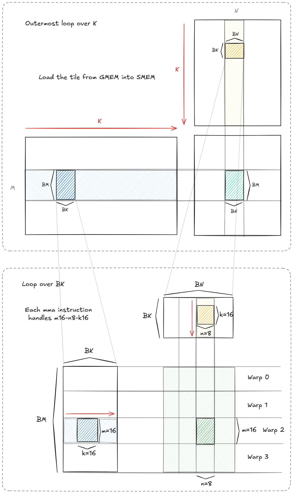

There are 3 hyperparameters that we can play with, namely `BM, BN, BK`. The table below shows the total latency of varying `BM, BN` while keeping `BK=16`.

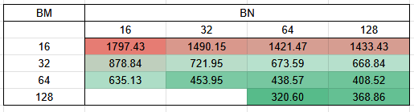

In general, the latency can be improved when `BM` or `BN` is increased, due to:
  - A warp handles 16 rows, hence increase in `BM` results in more warps. This can improve the occupancy and allows better latency hiding.
  - Increase in `BN` can improve the arithmetic intensity as the same input tile multiplies with multiple weight tiles.

The results of the `m16-n8-k16 mma` is stored as follows in register. 

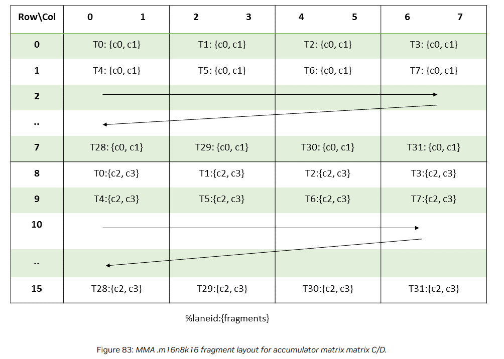

Note that, for every 8 columns, each thread will need additional 4 registers to store the result. Hence, having a high `BN` will increase the register pressure,

**Result**

Using PTX results in **320.6ms**, which is **1.75x** faster than the baseline but still slower than the `cuBLAS` approach.

## Residual

Residual can be treated as vector addition. We have experimented with a few approaches as shown below.

### Approach 1: [Naive Kernel](https://github.com/GJ0407790/CUDA-GPT2-Inference/blob/main/kernels/residual/1_residual_naive.cuh)

We start by implementing a simple vector addition kernel.

```cuda
__global__ void residual_forward_naive_kernel(float* out, float* inp1, float* inp2, int N) {
    int t = blockDim.x * blockIdx.x + threadIdx.x;

    if (t < N) 
    {
      out[t] = inp1[t] + inp2[t];
    }
}

void residual_forward_naive(float* out, float* inp1, float* inp2, int N) {
  const int block_size = 256;
  const int grid_size = (N - 1) / block_size + 1;
  residual_forward_naive_kernel<<<grid_size, block_size>>>(out, inp1, inp2, N);
}
```

The above code result in latency of **13.24ms** which is very close to the baseline latency of **12.3ms**. In fact, the baseline implementation is very similar to the above implementation. 

### Approach 2: [Cache Hints](https://github.com/GJ0407790/CUDA-GPT2-Inference/blob/main/kernels/residual/2_residual_cache_hint.cuh)

One optimization that can be done on approach 1 is using [cache hints](https://docs.nvidia.com/cuda/cuda-c-programming-guide/#store-functions-using-cache-hints). This is the exact impelmentation in the baseline.

```cuda
__global__ void residual_forward_cache_hint_kernel(float* out, const float* inp1, const float* inp2, int N) {
    int t = blockDim.x * blockIdx.x + threadIdx.x;

    if (t < N) 
    {
      out[t] = __ldcs(&inp1[t]) + __ldcs(&inp2[t]);
    }
}
```

However, using this approach resulted in **13.23ms** which is still **1ms** slower than the baseline approach. We suspect this is cause by the unoptimized kernel that precedes residual kernel.

## Layernorm


Layernorm can be visualize using the image above, where elements of a same row are normalized such that the final mean is 0 and final standard deviation is 1 before going through a transformation. 

### Approach 1: [Block Reduction](https://github.com/GJ0407790/CUDA-GPT2-Inference/blob/main/kernels/layernorm/1_layernorm_block.cuh)

Since we have to iterate through all elements of a row to find the mean and standard deviation, an intuitive approach is to assign a block to handle a single row.

Each thread handles 4 elements in a row. For the ease of visualization, the row below has only 16 elements and each block has only 4 threads (during execution, the row has 768 elements and block size is 192).

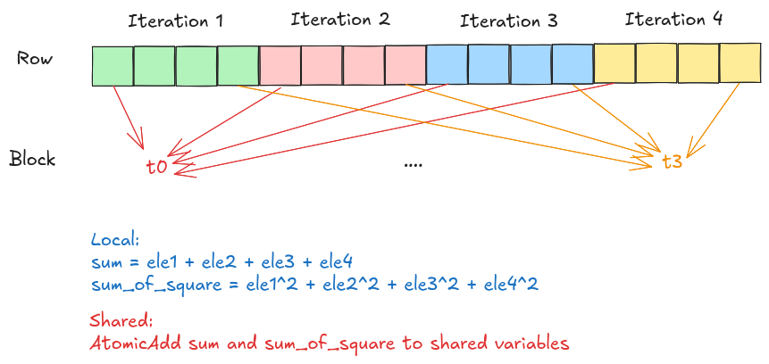

This approach took **27.17ms**, which is **3 times** slower than the baseline approach.

### Approach 2: [Vectorized Block Reduction](https://github.com/GJ0407790/CUDA-GPT2-Inference/blob/main/kernels/layernorm/2_layernorm_block_vectorized.cuh)

One small optimization that can be done is [vectorized memory access](https://developer.nvidia.com/blog/cuda-pro-tip-increase-performance-with-vectorized-memory-access/). In this approach, each thread will load 4 consecutive elements using a single load instruction.

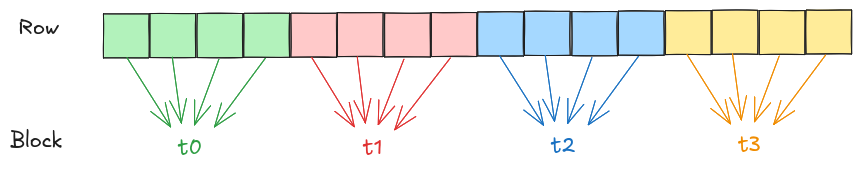

Looking at assembly for approach 1 and 2, we can see different instructions used for loads, e.g. `LDG.E.CI.128, LDG.E.CI`.

```sass
layernorm_forward_block_vectorized_kernel:
 LDG.E.CI.128 R4, [R4]

layernorm_forward_block_kernel:
 LDG.E.CI R19, [R16]
```

This approach took **26.46ms** which is around **2.6%** improvement compared to approach 1.

### Approach 3: [Warp Reduction](https://github.com/GJ0407790/CUDA-GPT2-Inference/blob/main/kernels/layernorm/3_layernorm_warp.cuh)

Approach 2 has 2 downsides:

1. Atomic contention on 2 shared variables.
2. `__syncthreads` needed to coordinate the shared variables.

We can overcome the downsides mentioned above by letting a single warp to handle a row and communicate using either [cooperative groups](https://docs.nvidia.com/cuda/cuda-c-programming-guide/#cooperative-groups) or [warp shuffle functions](https://docs.nvidia.com/cuda/cuda-c-programming-guide/#warp-shuffle-functions). However, this means that each thread has to handle more elements in a row, in our case, from 4 elements per thread to 24 elements per thread. This will result in higher register pressure since the elements are stored locally as registers.

This approach took **5.1ms** which achieved **5.19x** speedup compared to approach 2. In addition, this is **1.8x** faster than the baseline approach.

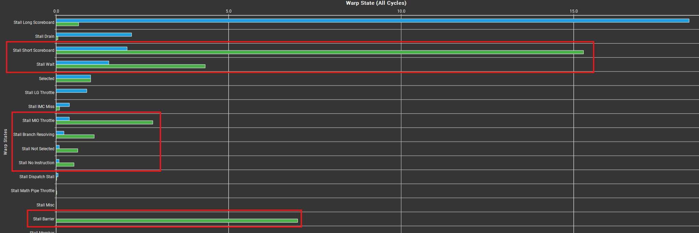

Looking at the warp states, observed that approach 3 (blue) stalls significantly less than approach 2 (green) in:
- **Stall Short Scoreboard:** Indicates the contention to shared memory.
- **Stall Barrier:** Approach 3 has no synchronizations.

However, approach 3 still suffers stalls from long scoreboard which indicates that memory latency from global memory is not well hidden. In other words, approach 3 is memory bound which can be seen in the graph below.

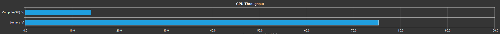

## Fused Residual and Layernorm

If we look at the flow graph in [Introduction](#introduction), we can observe that layernorm kernels are precede with residual kernels, except for the first layernorm kernel. 
In addition, both residual and layernorm kernels are memory bound, we could potentially merge these 2 kernels into a single kernel. This technique is known as kernel fusion.

Kernel fusion has several advantages:
- Reduce the number of memory requests to global memory as shown in the image below.
- Reduce multiple kernel launch overheads into single kernel launch overhead.

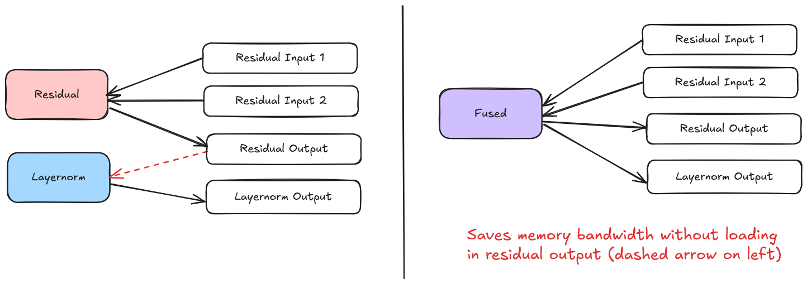

The implementation can be found in [fused_residual_layernorm.cuh](./kernels/fused_residual_layernorm/fused_residual_layernorm.cuh).

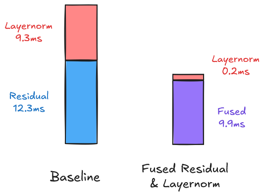

Using this approach resulted in total **10.1ms** which is **2.13x** speedup compared to the sum of residual and layernorm in baseline implementation. Note that there is still 1 instance of layernorm (the first instance) in the fusion appraoch.

## Attention

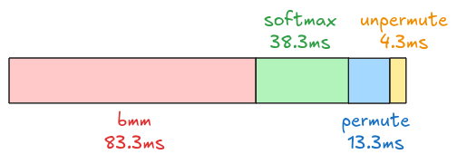
