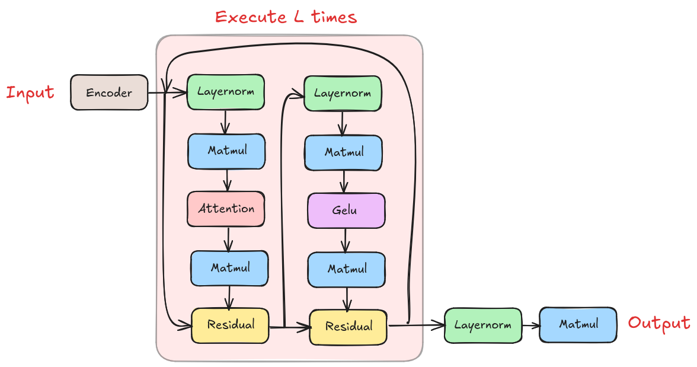

# CUDA GPT2 Inference

## Introduction

[TODO:] Introduce GPT2.



The image above shows the flow of the inference step:
- `encoder`:
- `layernorm`:
- `matmul`:
- `attention`:
- `residual`:
- `gelu`:


## Baseline

We will use Karpathy's [llm.c](https://github.com/karpathy/llm.c) as the baseline of our optimizations. Specifically, `train_gpt2_fp32.cu` is the code that we ran as the baseline.


As we can see from the figure above, `matmul` has the highest latency of ....

## Residual

Residual can be treated as vector addition. We have experimented with a few approaches as shown below.

### Approach 1: Naive Kernel

We start by implementing a simple vector addition kernel.

```cuda
__global__ void residual_forward_naive_kernel(float* out, float* inp1, float* inp2, int N) {
    int t = blockDim.x * blockIdx.x + threadIdx.x;

    if (t < N) 
    {
      out[t] = inp1[t] + inp2[t];
    }
}

void residual_forward_naive(float* out, float* inp1, float* inp2, int N) {
  const int block_size = 256;
  const int grid_size = (N - 1) / block_size + 1;
  residual_forward_naive_kernel<<<grid_size, block_size>>>(out, inp1, inp2, N);
}
```

The above code result in latency of **13.24ms** which is very close to the baseline latency of **12.3ms**. In fact, the baseline implementation is very similar to the above implementation. 

### Approach 2: Cache Hints

One optimization that can be done on approach 1 is using [cache hints](https://docs.nvidia.com/cuda/cuda-c-programming-guide/#store-functions-using-cache-hints). This is the exact impelmentation in the baseline.

```cuda
__global__ void residual_forward_cache_hint_kernel(float* out, const float* inp1, const float* inp2, int N) {
    int t = blockDim.x * blockIdx.x + threadIdx.x;

    if (t < N) 
    {
      out[t] = __ldcs(&inp1[t]) + __ldcs(&inp2[t]);
    }
}
```

However, using this approach resulted in **13.23ms** which is still **1ms** slower than the baseline approach. We suspect this is cause by the unoptimized kernel that precedes residual kernel.

### Approach 3: Vectorized Kernel

Another approach that we tried was [vectorized memory access](https://developer.nvidia.com/blog/cuda-pro-tip-increase-performance-with-vectorized-memory-access/). 

```cuda
__global__ void residual_forward_vectorized_kernel(float* out, const float* inp1, const float* inp2, int N) {
    assert(N % 4 == 0);
    
    int t = blockDim.x * blockIdx.x + threadIdx.x;

    auto inp1_vec = reinterpret_cast<const float4*>(inp1);
    auto inp2_vec = reinterpret_cast<const float4*>(inp2);
    auto out_vec = reinterpret_cast<float4*>(out);

    if (t < N) 
    {
      float4 inp1s = inp1_vec[t];
      float4 inp2s = inp2_vec[t];
      out_vec[t] = make_float4(
                    inp1s.x + inp2s.x,
                    inp1s.y + inp2s.y,
                    inp1s.z + inp2s.z,
                    inp1s.w + inp2s.w);
    }
}

void residual_forward_vectorized(float* out, const float* inp1, const float* inp2, int N) {
  const int block_size = 256;
  const int grid_size = (N - 1) / (4 * block_size) + 1;
  residual_forward_vectorized_kernel<<<grid_size, block_size>>>(out, inp1, inp2, N);
}
```

We would expect the vectorized approach to be more faster, however, we achieved a similar latency of **13.35ms** using this approach.

Note that the naive implementation's memory access is already coalesced. Hence, the benefit of using vectorized memory access is for its smaller instruction sizes, which is not the case here. As shown below, there are 3 more iinstructions for `residual_forward_vectorized_kernel` due to the extra 3 additions.


```sass
residual_forward_vectorized_kernel(float*, float const*, float const*, int):
 SHL R6, R0.reuse, 0x4 
 SHR R0, R0, 0x1c 
 IADD R2.CC, R6.reuse, c[0x0][0x148] 
 IADD.X R3, R0.reuse, c[0x0][0x14c] 
 IADD R4.CC, R6, c[0x0][0x150] 
 LDG.E.128 R8, [R2]         
 IADD.X R5, R0, c[0x0][0x154] 
 LDG.E.128 R12, [R4] 
 IADD R6.CC, R6, c[0x0][0x140] 
 IADD.X R7, R0, c[0x0][0x144] 
 FADD R11, R11, R15 
 FADD R10, R10, R14 
 FADD R9, R9, R13 
 FADD R8, R8, R12 
 STG.E.128 [R6], R8

residual_forward_naive_kernel(float*, float const*, float const*, int):
 SHL R6, R0.reuse, 0x2 
 SHR R0, R0, 0x1e 
 IADD R4.CC, R6.reuse, c[0x0][0x148] 
 IADD.X R5, R0.reuse, c[0x0][0x14c] 
 IADD R2.CC, R6, c[0x0][0x150] 
 LDG.E R4, [R4]         
 IADD.X R3, R0, c[0x0][0x154] 
 LDG.E R2, [R2] 
 IADD R6.CC, R6, c[0x0][0x140] 
 IADD.X R7, R0, c[0x0][0x144] 
 FADD R0, R2, R4 
 STG.E [R6], R0
```

## Layernorm


Layernorm can be visualize using the image above, where elements of a same row are normalized such that the final mean is 0 and final standard deviation is 1 before going through a transformation. 

### Approach 1: Block Reduction

Since we have to iterate through all elements of a row to find the mean and standard deviation, an intuitive approach is to assign a block to handle a single row.

### Approach 2: Warp Reduction

## Fused Residual and Layernorm

## Matmul

## Attention